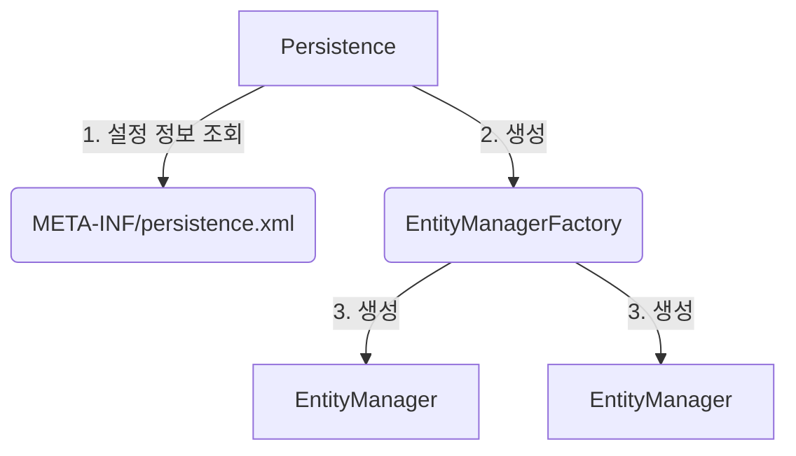

# How to run jpa



Persistence 클래스가 설정 정보를 읽어서 EntityManagerFactory 생성 이후 필요시 마다 EntityManager 생성

- EntityManagerFactory 는 애플리케이션 로딩 시점에 하나만 만들어서 사용한다  (애플리케이션 전체에서 공유)  
- 트랜젝션의 단위 마다 EntityManager 를 만들어서 사용한다 (엔티티 매니저는 쓰레드간에 공유X (사용하고 버려야 한다))  
- JPA의 모든 데이터 변경은 트랜잭션 안에서 실행  


## Hello JPA

```java
public class Main {
    public static void main(String[] args) {
        EntityManagerFactory emf = Persistence.createEntityManagerFactory("hello");
        EntityManager em = emf.createEntityManager();

        em.close();
        emf.close();
    }
}
```

```log
5월 18, 2025 4:50:12 오후 org.hibernate.jpa.internal.util.LogHelper logPersistenceUnitInformation
INFO: HHH000204: Processing PersistenceUnitInfo [name: hello]
5월 18, 2025 4:50:12 오후 org.hibernate.Version logVersion
INFO: HHH000412: Hibernate ORM core version 5.6.15.Final
5월 18, 2025 4:50:12 오후 org.hibernate.annotations.common.reflection.java.JavaReflectionManager <clinit>
INFO: HCANN000001: Hibernate Commons Annotations {5.1.2.Final}
5월 18, 2025 4:50:12 오후 org.hibernate.engine.jdbc.connections.internal.DriverManagerConnectionProviderImpl configure
WARN: HHH10001002: Using Hibernate built-in connection pool (not for production use!)
5월 18, 2025 4:50:12 오후 org.hibernate.engine.jdbc.connections.internal.DriverManagerConnectionProviderImpl buildCreator
INFO: HHH10001005: using driver [com.mysql.cj.jdbc.Driver] at URL [jdbc:mysql://localhost:13306/hello]
5월 18, 2025 4:50:12 오후 org.hibernate.engine.jdbc.connections.internal.DriverManagerConnectionProviderImpl buildCreator
INFO: HHH10001001: Connection properties: {password=****, user=root}
5월 18, 2025 4:50:12 오후 org.hibernate.engine.jdbc.connections.internal.DriverManagerConnectionProviderImpl buildCreator
INFO: HHH10001003: Autocommit mode: false
5월 18, 2025 4:50:12 오후 org.hibernate.engine.jdbc.connections.internal.DriverManagerConnectionProviderImpl$PooledConnections <init>
INFO: HHH000115: Hibernate connection pool size: 20 (min=1)
5월 18, 2025 4:50:13 오후 org.hibernate.dialect.Dialect <init>
INFO: HHH000400: Using dialect: org.hibernate.dialect.MySQL8Dialect
5월 18, 2025 4:50:13 오후 org.hibernate.engine.transaction.jta.platform.internal.JtaPlatformInitiator initiateService
INFO: HHH000490: Using JtaPlatform implementation: [org.hibernate.engine.transaction.jta.platform.internal.NoJtaPlatform]
5월 18, 2025 4:50:13 오후 org.hibernate.engine.jdbc.connections.internal.DriverManagerConnectionProviderImpl$PoolState stop
INFO: HHH10001008: Cleaning up connection pool [jdbc:mysql://localhost:13306/hello]
```
