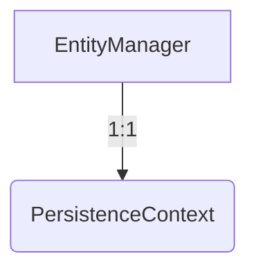
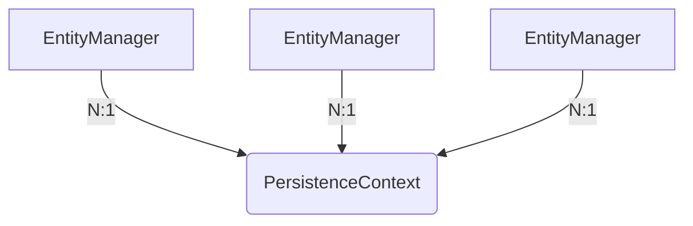
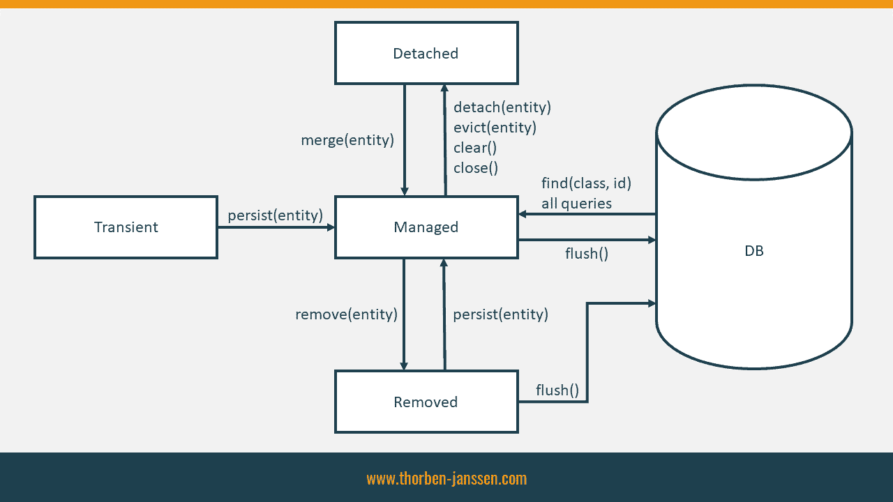

# Persistence Context

엔티티를 영구 저장하는 환경

```java
EntityManager.persist(entity);
```

DB 저장이 아닌 엔티티를 영속성 컨텍스트에 저장한다는 의미 (영속성 컨텍스트를 통해서 영속화 한다는 의미)

J2SE 환경
- 엔티티 매니저와 영속성 컨텍스트가 1:1



J2EE, 스프링 프레임워크 같은 컨테이너 환경
- 엔티티 매니저와 영속성 컨텍스트가 N:1
- 


## 엔티티의 생명주기

- 비영속 (new/transient): 영속성 컨텍스트와 전혀 관계가 없는 새로운 상태
- 영속 (managed): 영속성 컨텍스트에 관리되는 상태
- 준영속 (detached): 영속성 컨텍스트에 저장되었다가 분리된 상태
- 삭제 (removed): 삭제된 상태



[thorben-janssen.com/entity-lifecycle-model](https://thorben-janssen.com/entity-lifecycle-model/)

## 이점

- 1차 캐시
- 동일성(identity) 보장
  - 1차 캐시로 반복 가능한 읽기(REPEATABLE READ) 등급의 트랜잭션 격리 수준을 데이터베이스가 아닌 애플리케이션 차원에서 제공
- 트랜잭션을 지원하는 쓰기 지연 (transactional write-behind)
  - flush 시점에 SQL을 데이터베이스에 보냄
  - hibernate.jdbc.batch_size: 최대 몇 개까지 statements 를 batch 처리를 할 것인지에 대한 옵션
- 변경 감지(Dirty Checking)
  - flush 시점에 영속성 컨텍스트에 변경 내역을 확인(엔티티와 스냅샷 비교)하여 update 처리
- 지연 로딩(Lazy Loading)

## flush

영속성 컨텍스트의 변경내용을 데이터베이스에 반영
- 영속성 컨텍스트를 비우지 않음
- 영속성 컨텍스트의 변경내용을 데이터베이스에 동기화
- 트랜잭션이라는 작업 단위가 중요 -> 커밋 직전에만 동기화 하면 됨

flush 발생 시점
- em.flush() - 직접 호출
- 트랜잭션 커밋 - 플러시 자동 호출
- JPQL 쿼리 실행 - 플러시 자동 호출
  - 변경 내역을 JPQL 쿼리에 반영이 되어야 하기에 JPQL 쿼리 직전 플러시 됨

플러시 모드 옵션
- `em.setFlushMode(FlushModeType.COMMIT)`
- FlushModeType.AUTO: 커밋이나 쿼리를 실행할 때 플러시 (기본값)
- FlushModeType.COMMIT: 커밋할 때만 플러시

## 준영속(detached) 상태

- 영속 -> 준영속
- 영속 상태의 엔티티가 영속성 컨텍스트에서 분리(detached)
- 영속성 컨텍스트가 제공하는 기능을 사용 못함

준영속 상태로 만드는 방법
- em.detach(entity): 특정 엔티티만 준영속 상태로 전환
- em.clear(): 영속성 컨텍스트를 완전히 초기화
- em.close(): 영속성 컨텍스트를 종료
