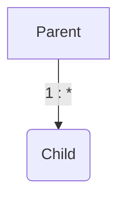

# Proxy

[Example code](../src/main/java/proxy/Main.java)

## Loading

- fetch: 글로벌 페치 전략을 설정
  - @ManyToOne=FetchType.EAGER
  - @OneToOne=FetchType.EAGER
  - @OneToMany=FetchType.LAZY
  - @ManyToMany=FetchType.LAZY

### N + 1

[Example code](../src/main/java/proxy/EagerLoadNPlusOne.java)

JPQL은 그대로 SQL로 변경되어 나감, 따라서 EAGER 설정이 먹지 않음  
결국 Member 가 10개면 Team 조회 쿼리 10개가 나가는 상황  
이를 `N + 1` 이라 표현한다

해결
- JPQL fetch join
- EntityGraph
- Batch Size

## 영속성 전이(CASCADE)

[Example code](../src/main/java/proxy/cascade/CascadeMain.java)

특정 엔티티를 영속 상태로 만들 때 연관된 엔티티도 함께 영속 상태로 만들고 싶을때

아래와 같이 부모 엔티티를 저장할 때 자식 엔티티도 함께 저장



영속성 전이는 연관관계를 매핑하는 것과 아무 관련이 없음

엔티티를 영속화할 때 연관된 엔티티도 함께 영속화하는 편리함을 제공할 뿐 

- ALL: 모두 적용
- PERSIST: 영속
- REMOVE: 삭제
- MERGE: 병합
- REFRESH: REFRESH
- DETACH: DETACH

## 고아 객체

[Example code](../src/main/java/proxy/cascade/OrphanMain.java)

고아 객체 제거: 부모 엔티티와 연관관계가 끊어진 자식 엔티티를 자동으로 삭제

참조가 제거된 엔티티는 다른 곳에서 참조하지 않는 고아 객체로
보고 삭제하는 기능

```
orphanRemoval = true
```

```
Parent parent1 = em.find(Parent.class, id);
parent1.getChildren().remove(0);
//자식 엔티티를 컬렉션에서 제거
```

- 참조하는 곳이 하나일 때 사용해야함!
- 특정 엔티티가 개인 소유할 때 사용
- @OneToOne, @OneToMany만 가능
- 고아 객체 제거 기능을 활성화 하면, 부모를 제거할 때 자식도 함께 제거된다. 이것은 CascadeType.REMOVE처럼 동작한다.

## CascadeType.ALL + orphanRemoval=true

두 옵션을 모두 활성화 하면 부모 엔티티를 통해서 자식의 생명주기를 관리할 수 있음

도메인 주도 설계(DDD)의 Aggregate Root개념을 구현할 때 유용
